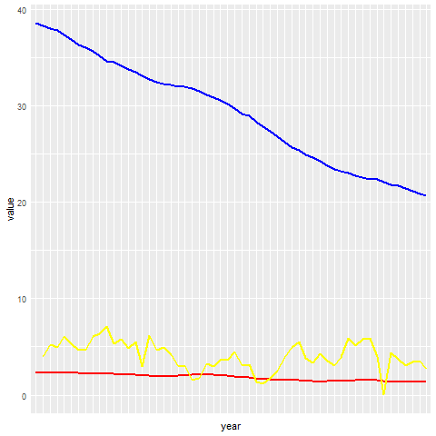

Conclusion
---
### World data analysis

**Blue line** : Birth rate (world average)

**Yello line**: GDP growth rate (world average)

**Red line** : Population growth rate (world averge)

According to the world data tendency,
- Birth rate is continously decreasing.
- poplulation growth rate is slightly decreasing. But due to large popluation base, the increasing volumn is still substantial.
- GDP growth rate continusly fluctuating for the lastest 50 years. But it keeps above of the o line. Only in 2009, the world GDP growth reached the bottom, which is very close to zero. In 2008, global economy was threatened by worldwide financial crsis. We slipped into capital winter.
- Relationship
-- On the world level, birth rate and GDP have little corelation with each other. The world popluation and GDP growth rate appears on the same level during these 50 years.

### Region comparison
- Sub-Saharan Africa maintains high birth rate. East Asian area experienced a droping brith rate. North American and Europe remain to be the last two lowest birth rate regions.
- As for the population growth, Middle East & North Africa Area remains to be the highest region. Sub-Saharan Africa's population growth rate rocketed, due to less war, better medical condition and international contributions.
- There is a changing trend in regions' GDP growth rate. But there is an obvious tendency in North American area that its GDP growth plunged in these 50 years. But the changing development pattern from developing country to developed country also accouts for this.

### Country Statistic Chronological Comparison
- Birth rate has a positive relationhip with GDP growth in most of the cases.
- Population growth rate does not have a coordinate development (aka non-synchronous development) with birth rate. The death rate should be considered.

### Conclusion:
- Birth rate and GDP growth rate have a stronger relatiobnship within a small region, especially analysed on country level. The Theory of **Demographic Dividend** is more applicable within the country area.
- Birth rate has a positive relationhip with GDP growth in most of the cases.
- Birth rate has a direct impact on future working age group, which is the main drive of economic development.
- An increasing birth rate will leads to **Demographic window**, which means a period time period of time in a nation's demographic evolution when the proportion of population of working age group is particularly prominent. The growing birth rate will prolong this demographic window and maintain a country's economic dynamic, slowing down the speed of aging population.
